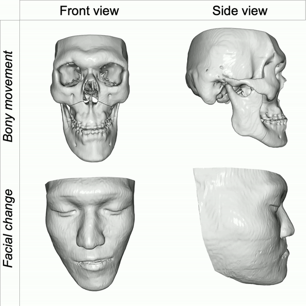
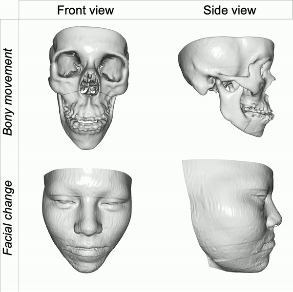

# Correspondence attention for facial appearance simulation

## Introduction
In this work, we have formulated an ACMT-Net incorporating a novel CPSA module. ACMT-Net is designed to accurately predict the change of one point set prompted by the movement of another point set. We further proposed a novel k-NN-based contrastive learning approach for pre-training the attentive correspondence between pairs of bony and facial point sets, which further enhances its capability to model spatial correspondence. The proposed ACMT-Net attains the same level of accuracy as the state-of-the-art FEM simulation method, while considerably reducing the computational time required during the surgical planning processes.

**Prerequisites**
- Linux (tested under Ubuntu 16.04 )
- Python (tested under 2.7)
- TensorFlow (tested under 1.4.0-GPU )
- numpy, h5py

The code is built on the top of [PointNET++](https://github.com/charlesq34/pointnet2). 
Before run the code, please compile the customized TensorFlow operators of PointNet++ under the folder "/Prediction_net/tf_ops".

**Train and test**

To trian a model:

`python -u run.py --mode=train  --gpu=0`

To test the trained model:

`python -u run.py --mode=test  --gpu=0`

Note that the train and test hdf5 files have been set in the program. If you have errors when running this code please check ALL the path first.
